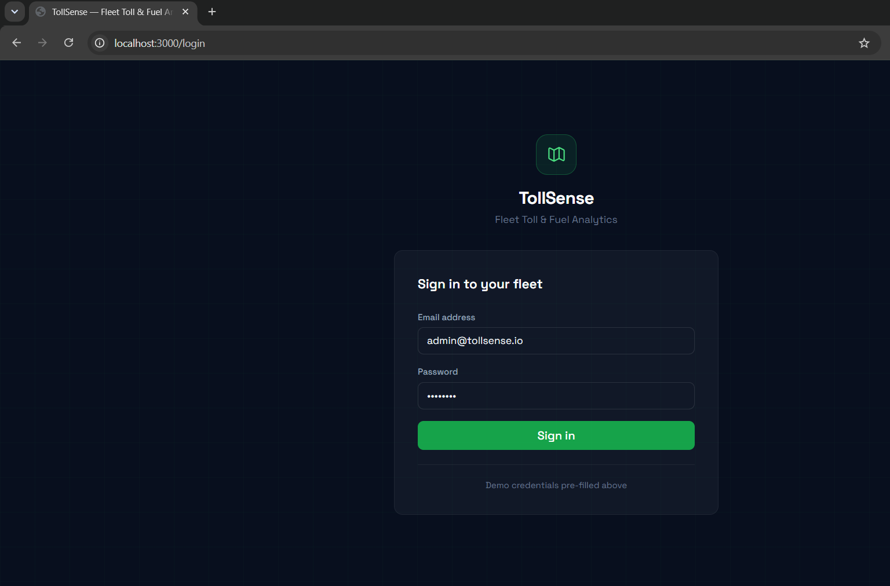
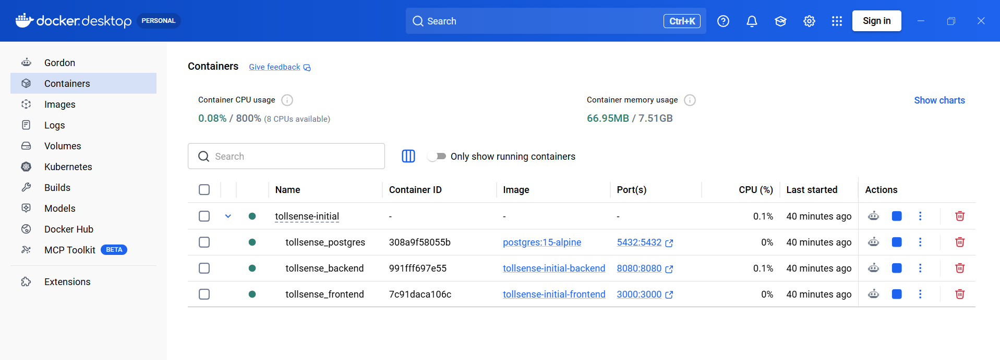
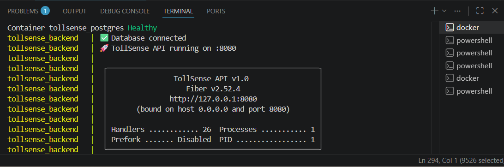
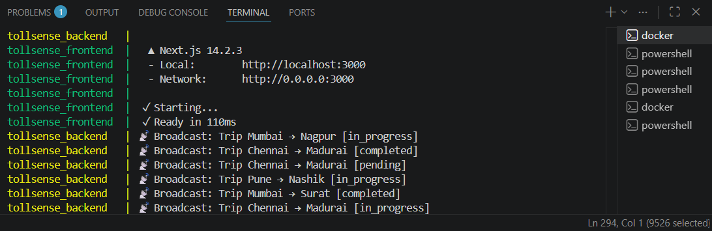
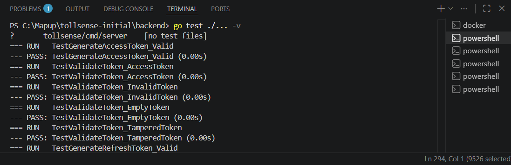
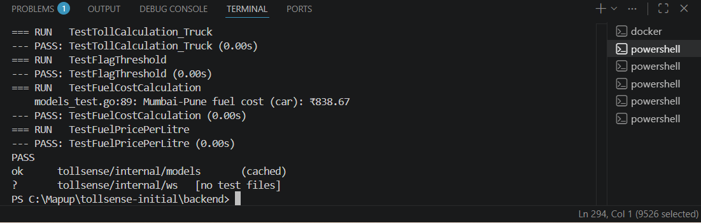
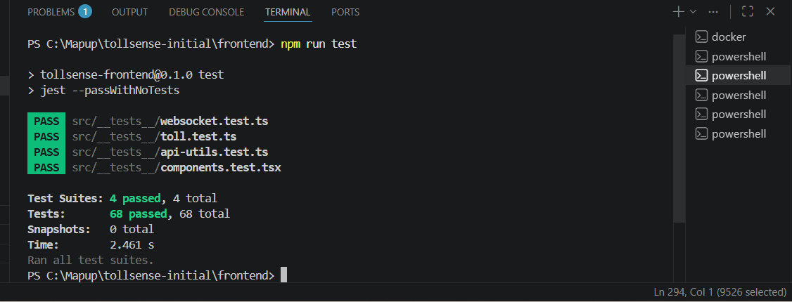
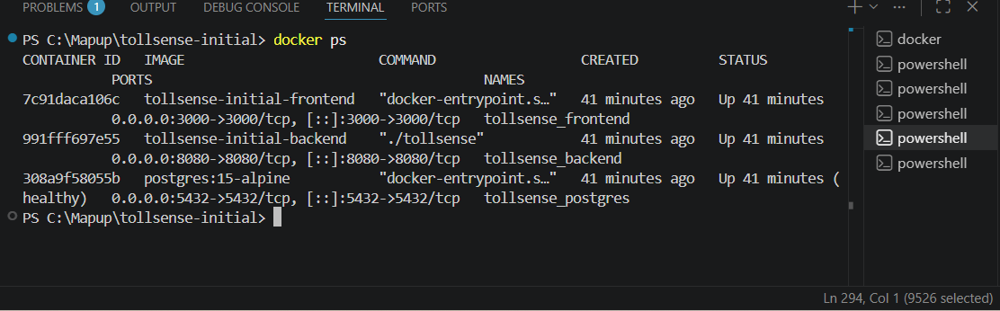

# TollSense: Fleet Analytics Dashboard

Full-stack fleet toll and fuel analytics platform. Upload a CSV of trips, get rule-based toll cost estimates per route, flagged expensive corridors, fuel stop recommendations, and a live WebSocket feed of trip status updates — all in a single `docker compose up`.

Built to demonstrate a production-grade Go + Next.js stack: JWT auth with refresh token rotation, PostgreSQL aggregation queries, goroutine-based WebSocket fan-out hub, CSV bulk-ingestion pipeline, Recharts analytics, and Leaflet route maps.

---

## Screenshots

| | |
|---|---|
|  |  |
| **Login** — JWT auth, pre-filled demo credentials | **Docker Desktop** — all 3 containers healthy |
|  |  |
| **Backend** — DB connected, Fiber v2 on :8080, 26 handlers | **WebSocket** — broadcaster emitting live trip events every 3s |
|  |  |
| **Go unit tests** — JWT package | **Go unit tests** — toll calc, fuel cost, flag threshold |
|  |  |
| **Jest** — 4 suites, 68 tests, 2.46s | **docker ps** — all containers up 41 min |

---

## Tech Stack

| Layer | Technology |
|---|---|
| Frontend | Next.js 14 (App Router), TypeScript, Tailwind CSS |
| State | Zustand |
| Charts | Recharts |
| Maps | Leaflet.js |
| CSV Parsing | PapaParse |
| Backend | Go 1.21 + Fiber v2.52 |
| Database | PostgreSQL 15 |
| Real-time | WebSockets — goroutine fan-out hub |
| Auth | JWT — 15-min access + 7-day refresh token |
| Infra | Docker Compose (3 services) |

---

## Architecture

```
┌──────────────────────────────────────────────────────┐
│  Next.js 14 (App Router)                    :3000     │
│  /dashboard  /trips  /route/[id]  /analytics          │
│  Zustand · Axios + JWT interceptor · WS hook          │
└─────────────────────┬────────────────────────────────┘
                      │ HTTP + WebSocket
┌─────────────────────▼────────────────────────────────┐
│  Go + Fiber v2                              :8080     │
│  POST /auth/login                                     │
│  POST /api/trips/upload  (CSV bulk ingest)            │
│  GET  /api/trips/:id/route  (toll breakdown)          │
│  GET  /api/analytics/{summary,spend,corridors}        │
│  WS   /ws/trips  (goroutine hub, sync.RWMutex)        │
└─────────────────────┬────────────────────────────────┘
                      │ sqlx / lib/pq
┌─────────────────────▼────────────────────────────────┐
│  PostgreSQL 15                              :5432     │
│  vehicles · trips · toll_estimates · corridors        │
└──────────────────────────────────────────────────────┘
```

---

## Quick Start

**Requires:** Docker Desktop

```bash
git clone https://github.com/Amit-netizen/tollsense-dashboard.git
cd tollsense-dashboard
docker compose up --build
```

Open **http://localhost:3000**

```
Email:    admin@tollsense.io
Password: admin123
```

PostgreSQL seeds 15 sample trips on first start. No manual setup needed.

### Local dev (without Docker)

<details>
<summary>Expand</summary>

**Start Postgres:**
```bash
docker run -d --name tollsense_pg \
  -e POSTGRES_USER=tollsense \
  -e POSTGRES_PASSWORD=tollsense123 \
  -e POSTGRES_DB=tollsense_db \
  -p 5432:5432 postgres:15-alpine

sleep 3
docker exec -i tollsense_pg psql -U tollsense -d tollsense_db \
  < backend/migrations/init.sql
```

**Backend:**
```bash
cd backend
go mod download
go run ./cmd/server
# → http://localhost:8080
```

**Frontend:**
```bash
cd frontend
npm install --legacy-peer-deps
echo "NEXT_PUBLIC_API_URL=http://localhost:8080
NEXT_PUBLIC_WS_URL=ws://localhost:8080" > .env.local
npm run dev
# → http://localhost:3000
```
</details>

---

## API Reference

All `/api/*` routes require `Authorization: Bearer <token>`.

| Method | Path | Description |
|---|---|---|
| `POST` | `/auth/login` | Returns access + refresh tokens |
| `POST` | `/auth/refresh` | Rotates access token |
| `GET` | `/health` | Liveness probe |
| `GET` | `/api/trips` | Paginated list (`?page&per_page&status`) |
| `GET` | `/api/trips/:id` | Single trip with toll estimate |
| `GET` | `/api/trips/:id/route` | Plaza breakdown + fuel stops |
| `POST` | `/api/trips/upload` | Bulk CSV ingest (`multipart/form-data`) |
| `GET` | `/api/vehicles` | Vehicle fleet |
| `GET` | `/api/analytics/summary` | KPI aggregations |
| `GET` | `/api/analytics/spend` | Daily toll spend, 30 days |
| `GET` | `/api/analytics/corridors` | Top 5 corridors by avg toll |
| `WS` | `/ws/trips` | Live trip status events, every 3s |

**CSV upload example:**
```bash
TOKEN=$(curl -s -X POST http://localhost:8080/auth/login \
  -H "Content-Type: application/json" \
  -d '{"email":"admin@tollsense.io","password":"admin123"}' \
  | grep -o '"access_token":"[^"]*"' | cut -d'"' -f4)

curl -X POST http://localhost:8080/api/trips/upload \
  -H "Authorization: Bearer $TOKEN" \
  -F "file=@sample_trips.csv"
```

Required CSV columns: `origin, destination, vehicle_id, distance_km`

---

## Running Tests

```bash
# Go unit tests
cd backend && go test -v ./...

# Frontend Jest tests (4 suites, 68 tests)
cd frontend && npm test

# Integration regression (45 checks, needs running backend)
bash test_integration.sh

# k6 load test
k6 run k6-load-test.js                        # smoke — 1 VU
k6 run -e SCENARIO=load k6-load-test.js       # load  — 50 VUs, 10 min
k6 run -e SCENARIO=stress k6-load-test.js     # stress — spike to 200 VUs
```

---

## Toll Rate Reference

Trips with toll > ₹400 are flagged as expensive corridors.

| Class | Rate (₹/km) | Fuel efficiency |
|---|---|---|
| Motorcycle | ₹0.50 | 45 km/L |
| Car | ₹1.00 | 18 km/L |
| LCV | ₹1.50 | 14 km/L |
| Bus | ₹2.00 | 6 km/L |
| Truck | ₹2.75 | 4.5 km/L |
| HCM | ₹3.50 | 3.5 km/L |

---

## Project Structure

```
tollsense-dashboard/
├── docker-compose.yml
├── sample_trips.csv           # test data for CSV upload
├── k6-load-test.js            # smoke / load / stress / spike / soak
├── test_integration.sh        # 45-point curl regression suite
├── TollSense.postman_collection.json
├── screenshots/
│
├── backend/
│   ├── cmd/server/main.go     # routes, middleware, WS upgrade
│   └── internal/
│       ├── auth/              # JWT generate + validate
│       ├── db/                # sqlx pool, retry on startup
│       ├── handlers/          # auth, trips, analytics
│       ├── middleware/        # JWT guard
│       ├── models/            # DB structs, toll + fuel rate tables
│       ├── ws/                # goroutine hub, fan-out broadcaster
│       └── migrations/        # schema + seed data
│
└── frontend/src/
    ├── app/                   # Next.js App Router pages
    ├── components/            # StatCard, StatusBadge, SpendChart,
    │                          #   CorridorChart, RouteMap (Leaflet)
    ├── hooks/useWebSocket.ts  # auto-reconnecting WS hook
    ├── lib/api.ts             # Axios + JWT interceptor + auto-refresh
    ├── store/                 # Zustand (auth, trips, live events)
    └── __tests__/             # 4 Jest suites, 68 tests
```

---

## Known Limitations

- No API rate limiting — Fiber's limiter middleware would be the next addition
- `JWT_SECRET` falls back to a hardcoded string if the env var is unset — always override in production
- `NEXT_PUBLIC_API_URL` is baked at Next.js build time; set the public backend URL before building for a non-local deployment
- WS `Broadcast` writes to each connection under a single `sync.RWMutex` — correct for one broadcaster goroutine; a per-client write channel would be needed at higher concurrency

---

## License

MIT
